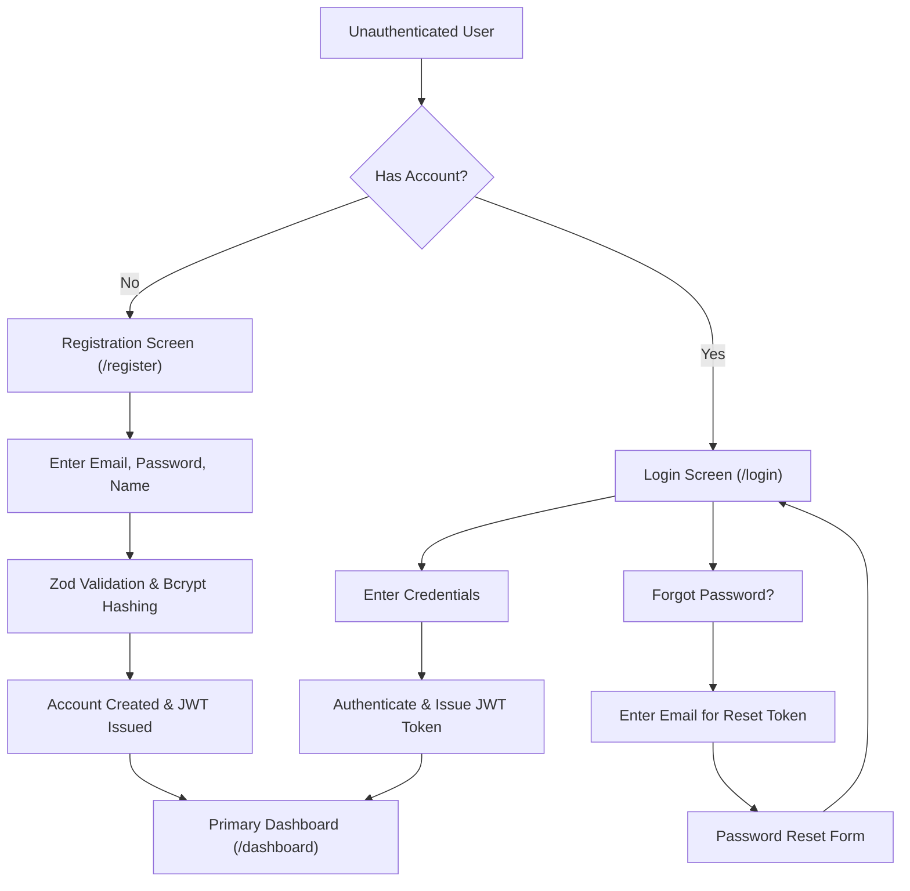
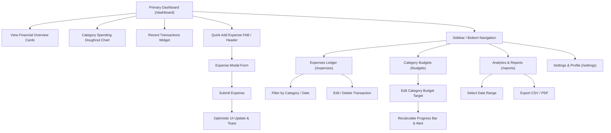

# Expense Tracker Pro — Application User Flow & Navigation Map (Step 4.1)

This document defines the high-level application flow, user entry points, authentication journey, dashboard navigation structure, and Mermaid sequence diagrams for **Expense Tracker Pro**.

---

## 1. High-Level Application Architecture & Entry Points

Users interact with Expense Tracker Pro through distinct entry points depending on their session state:

- **Unauthenticated Entry Points**:
  - Landing / Marketing Page (`/`)
  - Login Screen (`/login`)
  - Registration Screen (`/register`)
  - Password Recovery Screen (`/forgot-password`)
- **Protected Entry Points** (Guarded by JWT Auth Middleware):
  - Primary Dashboard (`/dashboard`)
  - Expense Ledger (`/expenses`)
  - Category Budgets (`/budgets`)
  - Financial Analytics & Reports (`/reports`)
  - User Settings & Preferences (`/settings`)

---

## 2. Authentication Flow (`AUTH-FLOW`)

### User Registration & Login Journey:

- **Session Guard**: Accessing any protected route (`/dashboard`, `/expenses`, etc.) without a valid token automatically redirects the user to `/login?redirect=<target_route>`.
- **Logout Action**: Clicking Logout clears local token state, invalidates active sessions, and redirects to `/login` with a confirmation toast notification.

---

## 3. Dashboard & Core Feature Navigation Flow (`DSH-FLOW`)

Once authenticated, the user lands on the **Primary Dashboard**, acting as the central command hub:

---

## 4. Feature Navigation Map

| Current Screen               | Action / User Trigger      | Destination Screen       | Behavior                        |
| :--------------------------- | :------------------------- | :----------------------- | :------------------------------ |
| **Login (`/login`)**         | Click "Create Account"     | Register (`/register`)   | Smooth page transition          |
| **Register (`/register`)**   | Submit Form                | Dashboard (`/dashboard`) | JWT saved, toast welcome        |
| **Dashboard (`/dashboard`)** | Click "Add Expense" FAB    | Modal Overlay            | Slide-up modal drawer           |
| **Dashboard (`/dashboard`)** | Click "View All" on Ledger | Expenses (`/expenses`)   | Full table view with pagination |
| **Expenses (`/expenses`)**   | Click Transaction Row      | Transaction Detail Modal | Inline edit or delete option    |
| **Budgets (`/budgets`)**     | Adjust Budget Slider/Input | Instant Recalculation    | Amber/Red indicator update      |
| **Reports (`/reports`)**     | Click "Export CSV"         | File Download            | Client-side file trigger        |
| **Any Screen**               | Click "Logout" in Sidebar  | Login (`/login`)         | Token cleared, toast feedback   |
